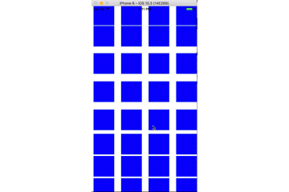

# BouncyLayoutOC

This project is inspired by **roberthein**'s project [<u>**BouncyLayout**</u>](https://github.com/roberthein/BouncyLayout), I just implement it by Objective-C.

When I use OC to implement it, compare with the swift code, **obviously** swift is more readable and compact!

It's time to learn Swift now!



## How to use

Clone or download this project, copy HWBouncyLayout.h & HWBouncyLayout.m files into your project.

Import HWBouncyLayout.h, init the layout.

```objective-c
- (instancetype)init;
- (instancetype)initWithStyle:(BouncyLayoutStyle)style;
- (instancetype)initWithDamping:(CGFloat)damping frequency:(CGFloat)frequency;
```

> The param damping and frequency is UIAttachmentBehavior prop, by default:
>
> damping = 0.7
>
> frequency = 1.5

```objective-c
self.layout = [HWBouncyLayout new];
// config the layout...
self.layout.scrollDirection = UICollectionViewScrollDirectionVertical;
// init Collection wiht this layout.
self.collectionView = [[UICollectionView alloc] initWithFrame:self.view.bounds collectionViewLayout:self.layout];
```

